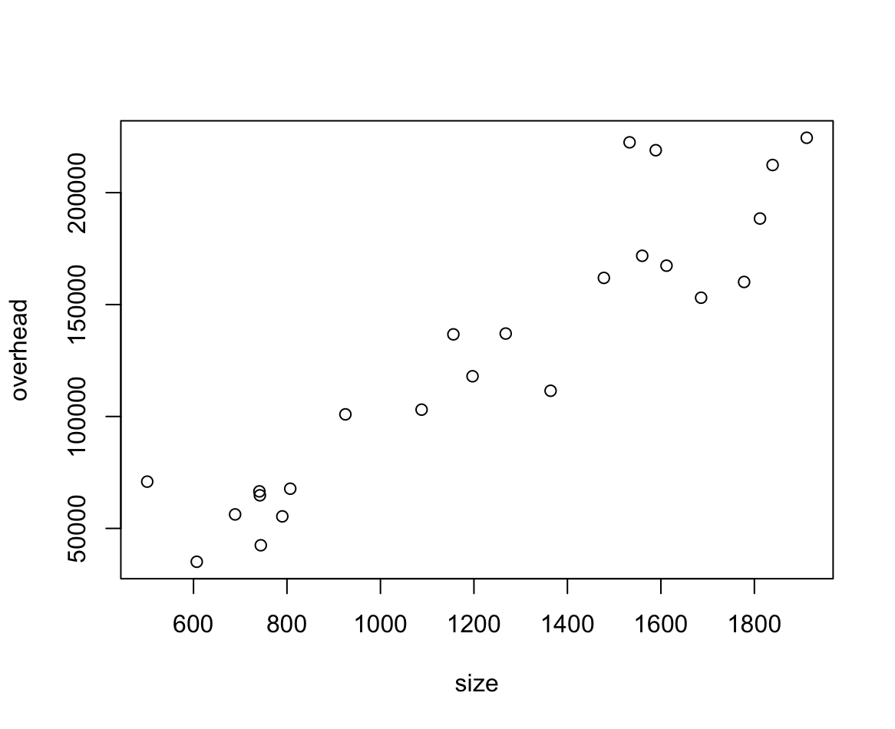

### 1.1 Introduction to Regression
"Are female faculty members paid less than their male counterparts?"
STAT 231 Approach:
Two-sample t-test:
- $H_0: \mu_M - \mu_F = 0$
- $H_a: \mu_M - \mu_F \neq 0$
- $\bar{x_M} - \bar{x_F} = \$2905$
- $t = \frac{\bar{x_M} - \bar{x_F}}{SE(\bar{x_M} - \bar{x_F})}$
- p-value = $0.5...$
- Conclusion: Male average salary greater than Females

Alternatively:
- $y = \beta_0 + \beta_1x + \epsilon$
- $ x = \begin{cases} 1 & \text{if Male} \\ 0 & \text{Otherwise} \end{cases}$
- $H_0: \beta_1 = 0$
- $H_a: \beta_1 \neq 0$

Potential Contounding Variables:
- Age
- Faculty/Department
- ...

To account for these variables, we can use a multiple regression model:
$y = \beta_0 + \beta_1x_{\text{gender}} + \beta_2x_{\text{age}} + \beta_3x_{\text{faculty}} + \cdots + \epsilon$

### 1.2 Graphical and Numerical Summaries for Bivariate Data
- <u>Audit data</u>:
    ```r
    > audit
    office year overhead size age employees  col clients
    1       1    1   218955 1589   3        15 1.03    2450
    2       2    1   224513 1912  19        15 1.00    2310
    3       3    1    66542  741   2         5 0.99     887
    4       4    1   212349 1839   3        17 0.93    2655
    5       5    1   161915 1478  14        13 0.98    2213
    6       6    1    42469  744  11         3 0.99     518
    7       7    1    55379  790  14         4 0.95     807
    8       8    1   100955  925  21         8 1.05    1149
    9       9    1   111487 1364   3         9 1.05    1490
    10     10    1   117974 1197   7         9 1.01    1559
    11     11    1    56248  689   6         5 1.06     708
    12     12    1    64782  742  20         4 0.97     818
    13     13    1    70893  501   9         5 1.09     943
    14     14    1   103057 1088   9         9 0.99    1613
    15     15    1   137049 1268   8        11 0.96    1913
    16     16    1   136687 1156  19        12 0.96    1888
    17     17    1    67731  807  19         4 1.04     739
    18     18    1   160098 1778  15        14 0.92    2134
    19     19    1   222472 1533  15        14 1.07    2332
    20     20    1   153061 1686  18        13 0.96    2155
    21     21    1   171788 1560   8        12 0.95    1879
    22     22    1   167373 1612   4        12 1.03    2040
    23     23    1   188435 1812  15        14 1.00    2147
    24     24    1    35099  607  11         2 0.95     492
    ```
    - responce variable, $y$: (claimed) overhead ($)
    - explanatory variable, $x$: office size (sq. ft.)

- Graphical Summaries:
    - Scatterplot
        ```r
        > plot(audit$size, audit$overhead)
        ```
        

- Numerical Summaries:
    - correlation coefficient
        - $r = \frac{\sum x_i - \bar{x})(y_i - \bar{y})}{\sqrt{\sum(x_i - \bar{x})^2 \sum(y_i - \bar{y})^2}} = \frac{S_{xy}}{\sqrt{S_{xx}S_{yy}}}$
        - $r$ is unitless
        - $-1 \leq r \leq 1$
        - $r$ is only relevant for <u>linear relationships</u>
        ```r
        > cor(size, overhead)
        [1] 0.9271985
        ```
    
### 1.3 The Simple Linear Regression Model

$y_i = \beta_0 + \beta_1x_i + \epsilon_i$, $i = 1, 2, \cdots, n$. Here $\beta_0$ is the intercept, $\beta_1$ is the slope, combined as the deterministic part of the model, and $\epsilon$ is the random error term.  $\beta_0$ and $\beta_1$ are parameters (i.e. unknown constants) of the population.

- Normal Model:
    $Y_i = \beta_0 + \beta_1x_i + \epsilon_i,\ \  \epsilon_i {\sim} N(0, \sigma^2)\ \ ind.\ \ , i=1,\cdots, n$
- Assumption of normal model:
    - functional form correctly specified ($\mu_i = \beta_0 + \beta_1x$)
    - errors are normal
    - errors have constant variance
    - errors are independent

### 1.4 Least Squares Estimation of Model Parameters
parameters ($\beta_0, \beta_1$):
- In <b>least sqaure estimation</b>, we find the values for $\beta_0$ and $\beta_1$, denoted by $\hat{\beta_0}$ and $\hat{\beta_1}$, respectively, that minimize the sum of squares of the errors, $\sum_{i=1}^{n} \epsilon_i^2$.
That is, we minimize $S(\beta_0, \beta_1) = \sum_{i=1}^{n} \epsilon_i^2 = \sum_{i=1}^{n} (y_i - (\beta_0 + \beta_1x_i))^2$ w.r.t. $\beta_0$ and $\beta_1$.
- Taking partial derivatives and setting to 0:
    - $\frac{\partial S}{\partial \beta_0} = \cancel{-2}\sum_{i=1}^{n} (y_i - \beta_0 - \beta_1x_i) = 0$
    - $\frac{\partial S}{\partial \beta_1} = \cancel{-2}\sum_{i=1}^{n} x_i(y_i - \beta_0 - \beta_1x_i) = 0$

    yeilds the normal equations:
    - $n\beta_0 + \beta_1\sum_{i=1}^{n} x_i = \sum_{i=1}^{n} y_i$
    - $\beta_0\sum_{i=1}^{n} x_i + \beta_1\sum_{i=1}^{n} x_i^2 = \sum_{i=1}^{n} x_iy_i$

    Solving them yeilds to the least squares estimates:
    - $\hat{\beta_0} = \bar{y} - \hat{\beta_1}\bar{x}$
    - $\hat{\beta_1} = \frac{\sum (x_i-\bar{x})(y_i-\bar{y})}{\sum (x_i-\bar{x})^2} = \frac{S_{xy}}{S_{xx}}$

Audit SLR Model:
```r
> summary(lm(audit$overhead ~ audit$size))

Call:
lm(formula = audit$overhead ~ audit$size)

Residuals:
   Min     1Q Median     3Q    Max 
-36639 -12874  -1997   8642  56686 

Coefficients:
             Estimate Std. Error t value Pr(>|t|)    
(Intercept) -27877.06   14172.00  -1.967   0.0619 .  
audit$size     126.33      10.88  11.610 7.47e-11 ***
---
Signif. codes:  0 ‘***’ 0.001 ‘**’ 0.01 ‘*’ 0.05 ‘.’ 0.1 ‘ ’ 1

Residual standard error: 23480 on 22 degrees of freedom
Multiple R-squared:  0.8597,	Adjusted R-squared:  0.8533 
F-statistic: 134.8 on 1 and 22 DF,  p-value: 7.472e-11
```
